# 🚀 Big Vision: Adversarial Assessment Intelligence Platform

## 1. 🌟 **Master System Architecture**

## 2. 🔄 **Self-Improving Assessment Pipeline**

```mermaid
graph TD
    A[📋 Domain Analysis<br/>Jobs/Benchmarks/Courses] --> B[💡 Inspiration Mining<br/>Successful Questions DB]
    B --> C[🎯 Adversarial Generation<br/>Multi-Model Orchestration]
    C --> D[🎓 Pedagogical Refinement<br/>Span Quality + Multi-Error]
    D --> E[🛡️ Anti-Cheat Integration<br/>Hidden Signals + Monitoring]
    E --> F[👥 Hirer Validation<br/>Buy-in Testing]
    F --> G{✅ Quality Gate}
    G -->|PASS| H[💾 Add to Success DB]
    G -->|FAIL| I[🔄 Evolutionary Feedback]
    I --> C
    H --> J[🧠 Pattern Analysis]
    J --> K[🎯 Transferable Intelligence<br/>Model Fine-tuning]
    K --> L[📈 Improved Generation]
    L --> A
    
    subgraph "🤖 Multi-Model Stack"
        M[Strong Guidance Model]
        N[Implementation Models]
        O[Judge Models]
        P[Anti-Cheat Models]
    end
    
    C --> M
    C --> N
    C --> O
    E --> P
```

## 3. 🎯 **Adversarial Stumping Architecture**

```mermaid
graph LR
    subgraph "🧠 Strong Model Guidance Layer"
        A[Strategic Question Designer<br/>Sonnet 3.5 v2]
        B[Error Pattern Analyzer]
        C[Difficulty Calibrator]
    end
    
    subgraph "🔄 Evolutionary System"
        D[Prompt Evolution Engine]
        E[Question Mutation System]
        F[Fitness Function Optimizer]
    end
    
    subgraph "🎯 Fine-tuning Pipeline"
        G[Adversarial Training Data]
        H[Model Specialization]
        I[Domain Adaptation]
    end
    
    subgraph "⚡ DSPy Optimization"
        J[Prompt Compilation]
        K[Multi-shot Learning]
        L[Chain-of-Thought Tuning]
    end
    
    A --> D
    B --> E
    C --> F
    
    D --> G
    E --> H
    F --> I
    
    G --> J
    H --> K
    I --> L
    
    J --> M[📊 Performance Metrics]
    K --> M
    L --> M
    M --> A
```

## 4. 🎓 **Pedagogical Quality Engine**

```mermaid
graph TD
    A[🎯 Generated Assessment] --> B[📍 Error Span Analyzer]
    B --> C[🔍 Ambiguity Detector]
    C --> D[🧩 Multi-Error Merger]
    D --> E[🎯 Tightness Validator]
    E --> F[👥 Hirer Buy-in Predictor]
    
    subgraph "📊 Quality Metrics"
        G[Span Precision Score]
        H[Pedagogical Value Index]
        I[Industry Relevance Rating]
        J[Anti-Nitpicking Score]
    end
    
    B --> G
    C --> H
    D --> I
    E --> J
    
    F --> K{✅ Quality Gate}
    K -->|PASS| L[✅ Approved Assessment]
    K -->|FAIL| M[🔄 Refinement Loop]
    M --> N[📝 Targeted Improvements]
    N --> A
    
    G --> K
    H --> K
    I --> K
    J --> K
```

## 5. 🛡️ **Anti-Cheating Infrastructure**

```mermaid
graph TB
    subgraph "🔍 Hidden Signal Detection"
        A[Steganographic Markers]
        B[Question Fingerprinting]
        C[Response Pattern Analysis]
    end
    
    subgraph "👀 Behavioral Monitoring"
        D[Keystroke Analysis]
        E[Time Pattern Detection]
        F[Copy-Paste Prevention]
        G[Tab/Window Monitoring]
    end
    
    subgraph "🧠 EEG Integration"
        H[Cognitive Load Measurement]
        I[Attention State Monitoring]
        J[Stress Response Analysis]
    end
    
    subgraph "🛠️ Standard Protections"
        K[Screen Recording Block]
        L[Dual Screen Detection]
        M[Browser Lockdown]
        N[Network Monitoring]
    end
    
    subgraph "🤖 AI-Powered Anti-Cheat"
        O[Response Authenticity Scorer]
        P[Collaboration Detection]
        Q[AI-Generated Content Detection]
    end
    
    A --> O
    B --> O
    C --> P
    D --> P
    E --> Q
    F --> Q
    
    H --> R[🎯 Integrated Cheat Score]
    I --> R
    J --> R
    O --> R
    P --> R
    Q --> R
```

## 6. 💡 **Inspiration Database Architecture**

## 7. 🧠 **Transferable Intelligence Loop**

```mermaid
graph TD
    A[📊 Pattern Recognition<br/>Across Domains] --> B[🎯 Intelligence Extraction<br/>What Makes Questions Hard?]
    B --> C[🔄 Cross-Domain Transfer<br/>Apply Patterns to New Areas]
    C --> D[🧪 Validation Testing<br/>Does Transfer Work?]
    D --> E{✅ Transfer Success?}
    E -->|YES| F[🎓 Fine-tune Models<br/>Encode New Intelligence]
    E -->|NO| G[🔍 Failure Analysis<br/>Why Didn't It Work?]
    G --> H[🛠️ Pattern Refinement]
    H --> A
    F --> I[📈 Enhanced Generation<br/>Smarter Questions]
    I --> J[🎯 New Domain Testing]
    J --> A
    
    subgraph "🧠 Intelligence Types"
        K[Conceptual Difficulty Patterns]
        L[Error-Prone Implementation Areas]
        M[Professional Context Sensitivity]
        N[Anti-Cheating Effectiveness]
    end
    
    B --> K
    B --> L
    B --> M
    B --> N
```

## 8. 🎨 **UI/UX Experience Architecture**

```mermaid
graph TB
    subgraph "🎯 Intent Capture Layer"
        A[Smart Topic Suggestion]
        B[Difficulty Auto-Calibration]
        C[Context-Aware Prompting]
    end
    
    subgraph "📱 Responsive Interface"
        D[Progressive Disclosure]
        E[Adaptive Complexity]
        F[Multi-Device Optimization]
    end
    
    subgraph "🎪 Challenge Balance"
        G[Not Nit-picky Detector]
        H[Engaging Difficulty Curve]
        I[Motivational Feedback]
    end
    
    subgraph "🛡️ Seamless Security"
        J[Invisible Monitoring]
        K[Natural Anti-Cheat]
        L[Stress-Free Validation]
    end
    
    A --> D
    B --> E
    C --> F
    
    D --> G
    E --> H
    F --> I
    
    G --> J
    H --> K
    I --> L
    
    J --> M[😊 User Satisfaction]
    K --> M
    L --> M
```

## 9. 🔬 **Research & Development Pipeline**

```mermaid
graph LR
    subgraph "🧪 Experimental Features"
        A[EEG-Based Validation]
        B[Advanced AI Detection]
        C[Neuroadaptive Difficulty]
    end
    
    subgraph "📊 Data Science Lab"
        D[Pattern Mining Algorithms]
        E[Effectiveness Prediction Models]
        F[Cross-Domain Transfer Learning]
    end
    
    subgraph "🎯 Production Testing"
        G[A/B Testing Framework]
        H[Gradual Feature Rollout]
        I[Real-World Validation]
    end
    
    A --> D
    B --> E
    C --> F
    
    D --> G
    E --> H
    F --> I
    
    G --> J[📈 Production Integration]
    H --> J
    I --> J
```

## 10. 🌐 **Ecosystem Integration**

```mermaid
graph TD
    subgraph "🏢 Enterprise Integrations"
        A[HR Systems APIs]
        B[Learning Management Systems]
        C[Certification Platforms]
    end
    
    subgraph "🎓 Educational Partnerships"
        D[University Course Integration]
        E[Bootcamp Curriculum Alignment]
        F[Professional Development Programs]
    end
    
    subgraph "🤖 AI Model Ecosystem"
        G[Multiple LLM Provider Support]
        H[Custom Model Fine-tuning]
        I[Specialized Domain Models]
    end
    
    A --> J[📊 Central Assessment Intelligence]
    B --> J
    C --> J
    D --> J
    E --> J
    F --> J
    
    G --> J
    H --> J
    I --> J
    
    J --> K[🎯 Unified Assessment Experience]
```

---

## 🎯 **Key Vision Elements**

### **1. Self-Improving Intelligence**
- System learns what makes assessments effective across domains
- Patterns transfer between technical, business, and creative fields
- Continuous fine-tuning creates smarter question generation

### **2. Anti-Cheating at the Core**
- Hidden signals embedded in questions themselves
- Multi-modal detection (behavioral, physiological, AI-generated)
- Seamless integration that doesn't impact user experience

### **3. Domain-Driven Approach**
- Real job requirements drive assessment creation
- Industry benchmarks inform difficulty calibration
- Hirer feedback creates closed-loop improvement

### **4. Pedagogical Excellence**
- Tight, unambiguous error spans
- Multiple related errors in single assessments
- Buy-in from actual hiring managers and educators

### **5. Transferable Intelligence**
- Patterns discovered in one domain enhance others
- End-to-end fine-tuning creates specialized models
- Cross-pollination of effective assessment strategies

This architecture supports the vision of creating an **intelligent assessment platform** that gets smarter over time, can't be gamed, and produces genuinely valuable evaluations across any domain.

What aspects of this vision would you like me to expand on or refine?