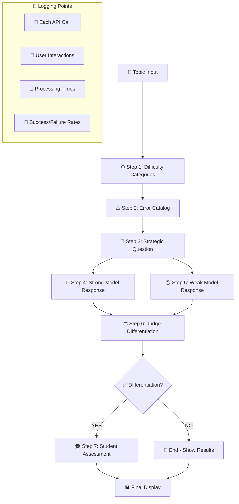

# 🚀 Streamlit Demo Light - Planning Document

## 🎯 **Project Objective**
Create a **lightweight Streamlit web app** that showcases the **7-step adversarial pipeline intelligence** with comprehensive logging, deployable as a shareable public demo.

---

## 📋 **Core Requirements**

### **1. Focus Areas**
- ✅ **Backend Intelligence Loop**: Highlight the 7-step API orchestration
- ✅ **Real-time Processing**: Show actual Claude API calls in action
- ✅ **Comprehensive Logging**: Track every usage and interaction
- ✅ **Shareable Demo**: Public Streamlit Community Cloud deployment
- ✅ **GitHub Integration**: Deploy from "demo-light" branch

### **2. Out of Scope** 
- ❌ Complex frontend interactions (no clickable error spans)
- ❌ Database storage (keep it simple with file logging)
- ❌ User authentication/sessions
- ❌ Advanced analytics dashboard

---

## 🏗️ **Architecture Design**

### **Streamlit App Structure**
```
streamlit_demo_light/
├── app.py                 # Main Streamlit application
├── pipeline/
│   ├── __init__.py
│   ├── seven_step_engine.py    # Simplified 7-step pipeline
│   └── structured_outputs.py   # Tool schemas for Claude API
├── logging/
│   ├── __init__.py
│   ├── demo_logger.py          # Comprehensive usage logging
│   └── log_viewer.py           # Simple log analysis
├── config/
│   ├── __init__.py
│   └── settings.py             # API keys, model configs
├── utils/
│   ├── __init__.py
│   └── helpers.py              # Utility functions
└── requirements.txt
```

---

## 🔄 **7-Step Pipeline Flow (Simplified)**



---

## 🎨 **UI/UX Design Plan**

### **Page Layout**
```
┌─────────────────────────────────────────────┐
│  🎯 Adversarial AI Assessment Generator     │
│  [Live Demo - 7-Step Intelligence Pipeline] │
├─────────────────────────────────────────────┤
│  Topic Input: [___________________] [Generate] │
├─────────────────────────────────────────────┤
│  📊 PIPELINE PROGRESS                       │
│  ✅ Step 1: Difficulty Categories [2.3s]   │
│  ✅ Step 2: Error Catalog [3.1s]           │
│  🔄 Step 3: Strategic Question [processing...]│
│  ⏳ Step 4: Strong Model Response          │
│  ⏳ Step 5: Weak Model Response            │
│  ⏳ Step 6: Judge Differentiation          │
│  ⏳ Step 7: Student Assessment             │
├─────────────────────────────────────────────┤
│  📋 RESULTS PREVIEW                         │
│  [Expandable sections for each step]        │
└─────────────────────────────────────────────┘
```

### **Progress Visualization**
- **Real-time progress bar** for overall completion
- **Step-by-step status** with timing information
- **API call indicators** showing model being used
- **Expandable sections** to view each step's output
- **Success/failure indicators** with retry information

---

## 📊 **Logging Strategy**

### **Log Data Points**
```python
log_entry = {
    "timestamp": "2025-01-14T10:30:45Z",
    "session_id": "uuid-string",
    "user_ip": "hash-for-privacy",
    "topic_requested": "Machine Learning Fundamentals",
    "steps_completed": 7,
    "total_duration": 45.2,
    "success": True,
    "api_calls": [
        {
            "step": 1,
            "model": "anthropic.claude-3-5-sonnet-20241022-v2:0",
            "duration": 2.3,
            "tokens_used": 156,
            "success": True
        }
        # ... for each step
    ],
    "differentiation_achieved": True,
    "weak_model_failures": 5,
    "rubric_score_estimate": 4.2
}
```

### **Log Storage Options**
1. **Simple File Logging** (for MVP): `logs/demo_usage.jsonl`
2. **Cloud Storage** (future): Upload to S3/GCS for analysis
3. **Real-time Metrics** (future): Send to analytics service

---

## 🛠️ **Technical Implementation Plan**

### **Phase 1: Core Pipeline (Week 1)**
```python
# app.py - Main Streamlit App
import streamlit as st
from pipeline.seven_step_engine import SimplifiedPipeline
from logging.demo_logger import DemoLogger

def main():
    st.title("🎯 Adversarial AI Assessment Generator")
    st.subheader("Live Demo - 7-Step Intelligence Pipeline")
    
    # Topic input
    topic = st.text_input("Enter a topic for assessment generation:")
    
    if st.button("Generate Assessment"):
        with st.container():
            # Initialize pipeline and logger
            pipeline = SimplifiedPipeline()
            logger = DemoLogger()
            
            # Run 7-step process with real-time updates
            run_pipeline_with_updates(pipeline, topic, logger)

def run_pipeline_with_updates(pipeline, topic, logger):
    """Run pipeline with real-time Streamlit updates"""
    progress_bar = st.progress(0)
    status_container = st.container()
    
    # Step-by-step execution with UI updates
    for step_num in range(1, 8):
        with status_container:
            st.write(f"🔄 Executing Step {step_num}...")
        
        result = pipeline.execute_step(step_num, topic)
        logger.log_step(step_num, result)
        
        progress_bar.progress(step_num / 7)
        
        # Display results
        with status_container:
            display_step_result(step_num, result)
```

### **Phase 2: Enhanced UI (Week 2)**
- **Real-time progress indicators**
- **Expandable result sections**
- **Error handling with user feedback**
- **Responsive design for mobile**

### **Phase 3: Advanced Logging (Week 3)**
- **Usage analytics dashboard**
- **Performance metrics**
- **A/B testing capabilities**
- **Export functionality**

---

## 🌐 **Deployment Strategy**

### **Streamlit Community Cloud Setup**
1. **GitHub Repository**: Create `demo-light` branch
2. **Streamlit Deployment**: Connect to Streamlit Community Cloud
3. **Environment Variables**: Configure AWS credentials securely
4. **Public URL**: Get shareable demo link

### **Repository Structure**
```
adversarial-demo/
├── branches/
│   ├── main/                 # Full system
│   └── demo-light/           # Streamlit demo
│       ├── streamlit_app.py  # Entry point (required name)
│       ├── requirements.txt  # Dependencies
│       ├── .streamlit/
│       │   └── config.toml   # Streamlit config
│       └── [app structure]
```

### **Configuration Management**
```toml
# .streamlit/config.toml
[theme]
primaryColor = "#FF6B6B"
backgroundColor = "#FFFFFF"
secondaryBackgroundColor = "#F0F2F6"
textColor = "#262730"

[server]
maxUploadSize = 10
enableCORS = false
```

---

## 📈 **Success Metrics**

### **Technical Metrics**
- ✅ **Pipeline Success Rate**: >90% completion rate
- ✅ **Average Response Time**: <60 seconds total
- ✅ **API Reliability**: <1% failure rate per step
- ✅ **Mobile Compatibility**: Works on phones/tablets

### **Usage Metrics**
- 📊 **Daily Active Users**: Track unique visitors
- 📊 **Topic Diversity**: Range of subjects tested
- 📊 **Session Duration**: User engagement time
- 📊 **Geographic Reach**: Global accessibility

### **Demo Effectiveness**
- 🎯 **Differentiation Success**: % of topics achieving 6+ judge score
- 🎯 **User Comprehension**: Feedback on pipeline clarity
- 🎯 **Sharing Rate**: Viral coefficient of demo URL
- 🎯 **Conversion Interest**: Follow-up inquiries

---

## 🔧 **Development Workflow**

### **Setup Steps**
1. **Create demo-light branch** from current main
2. **Strip down to essentials**: Remove complex frontend, database
3. **Simplify pipeline**: Focus on core 7-step logic
4. **Add comprehensive logging**: Track everything
5. **Deploy to Streamlit**: Get public shareable URL

### **Testing Strategy**
- **Local Development**: Test with various topics
- **Staging Deployment**: Verify on Streamlit cloud
- **Load Testing**: Ensure stability under usage
- **User Testing**: Get feedback from stakeholders

### **Monitoring Plan**
- **Real-time Logs**: Monitor for errors/performance
- **Usage Analytics**: Track demo effectiveness
- **Cost Monitoring**: AWS API usage tracking
- **Performance Alerts**: Automated notifications

---

## 🎯 **Key Design Principles**

### **1. Showcase Intelligence**
- **Visible API Orchestration**: Users see the multi-model coordination
- **Real-time Processing**: Watch the AI "think" through each step
- **Quality Results**: Demonstrate actual differentiation success

### **2. Maximum Logging**
- **Every Interaction**: Log all user inputs and behaviors
- **API Performance**: Track response times and success rates
- **Results Quality**: Measure differentiation effectiveness

### **3. Shareability**
- **Public URL**: Easy to share with investors, partners
- **Mobile Friendly**: Works on any device
- **Fast Loading**: Minimal dependencies for quick access

### **4. Maintainability**
- **Simple Architecture**: Easy to update and modify
- **Clear Separation**: Logic, UI, and logging cleanly separated
- **Version Control**: Track changes and rollback capability

---

## 🚀 **Next Steps**

### **Immediate Actions** (This Week)
1. ✅ **Create demo-light branch**
2. 🔄 **Implement simplified 7-step pipeline**
3. 🔄 **Build basic Streamlit UI**
4. 🔄 **Add comprehensive logging**

### **Short Term** (Next 2 Weeks)
1. 📊 **Deploy to Streamlit Community Cloud**
2. 🎯 **Test with multiple topics**
3. 📈 **Gather initial usage metrics**
4. 🛠️ **Iterate based on feedback**

### **Medium Term** (Next Month)
1. 📊 **Add usage analytics dashboard**
2. 🔄 **Optimize for performance and cost**
3. 🌐 **Share with broader audience**
4. 📈 **Analyze demo effectiveness**

This plan creates a focused, lightweight demo that effectively showcases the intelligence of your 7-step pipeline while gathering comprehensive data about its usage and effectiveness.