# 🏗️ System Architecture & Data Flow Diagrams v1.0

## 1. 🎯 **High-Level System Architecture**

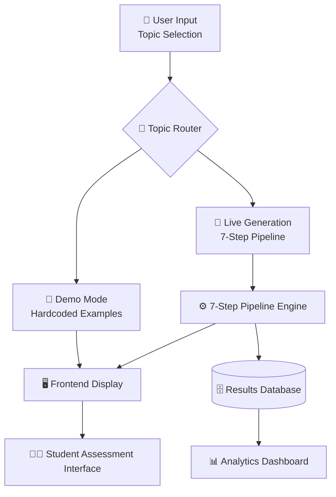

## 2. 🔄 **7-Step Pipeline Data Flow**

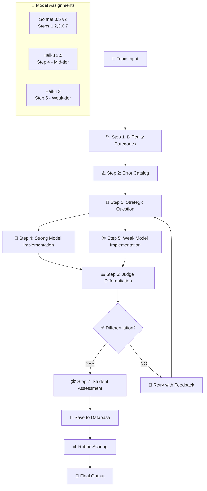

## 3. 🧠 **Agent Architecture Pattern**

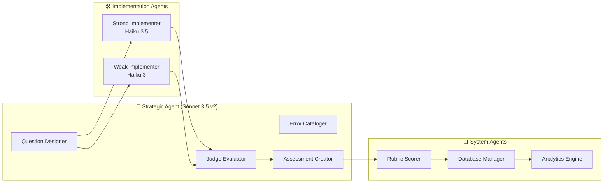

## 4. 🗃️ **Data Storage Architecture**

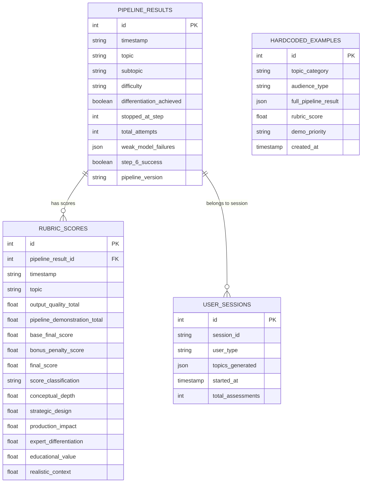

## 5. 🌐 **System Integration Flow**

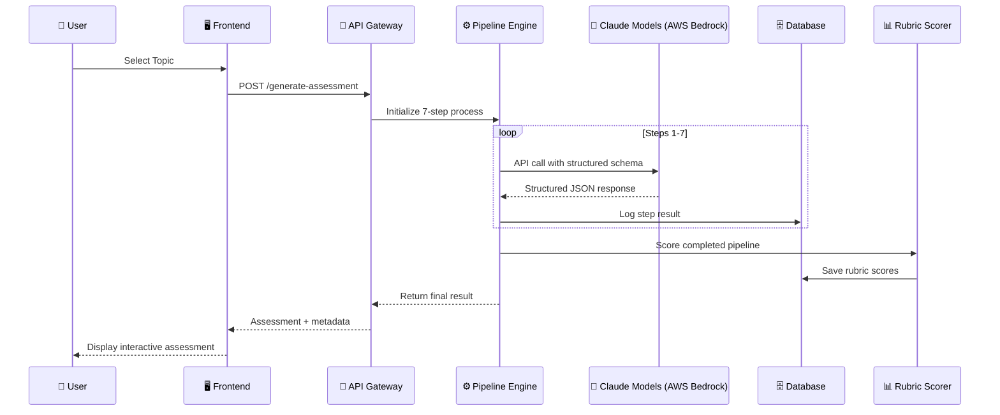

## 6. 🎪 **Demo Mode Architecture**

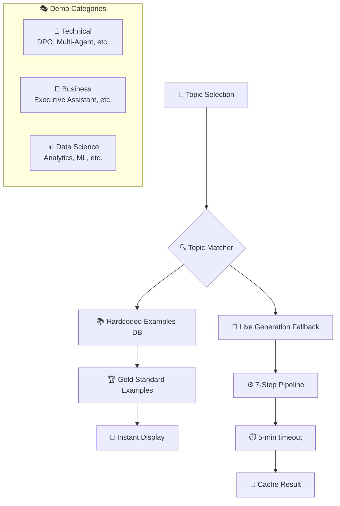

## 7. 🎨 **Frontend Component Architecture**

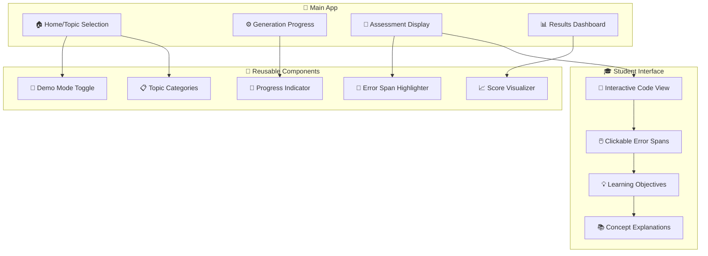

## 8. 🚀 **Deployment Architecture**

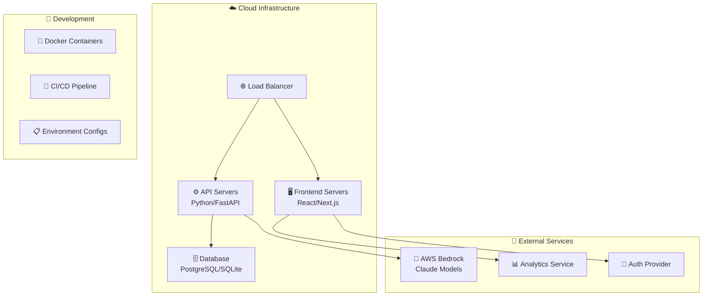

## 9. 📊 **Analytics & Monitoring Flow**

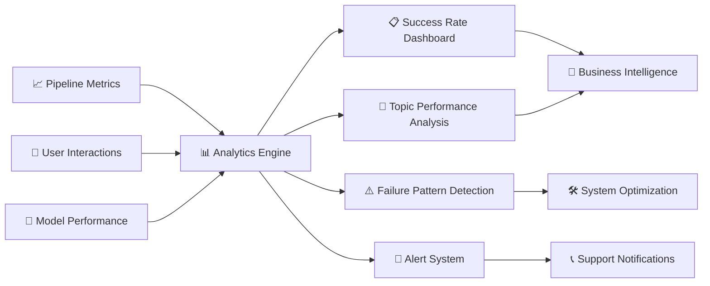

## 10. 🔄 **Feedback & Improvement Loop**

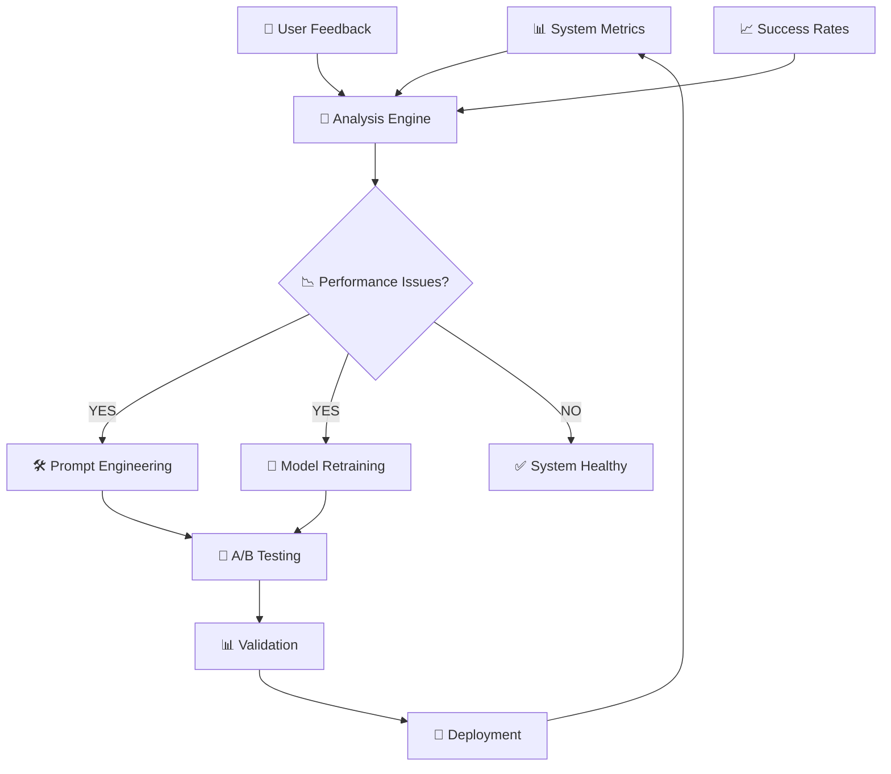

## 11. 🔧 **Structured Output Flow**

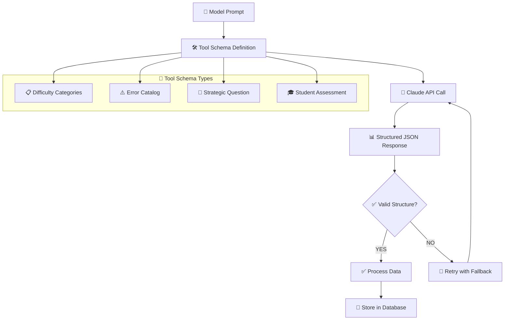

## 12. 🎯 **Topic Routing Logic**

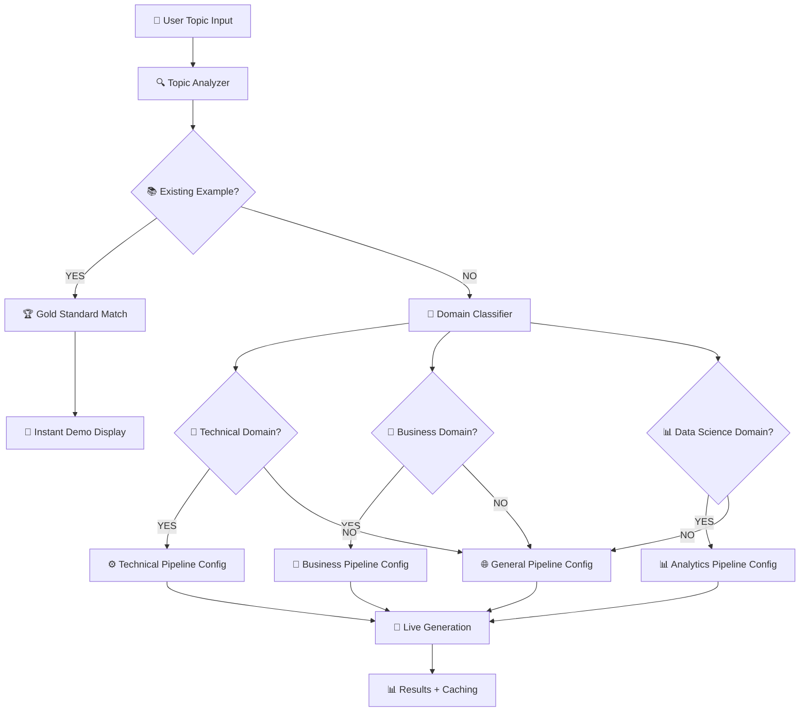

## 13. 🎪 **Demo vs Live Generation**

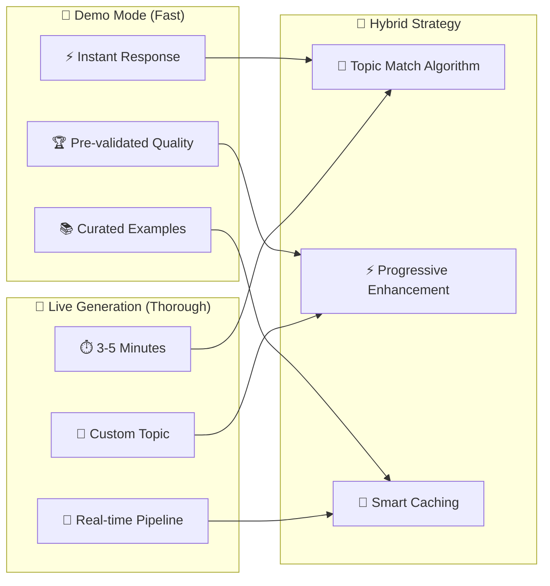

## 14. 📱 **Mobile-First Architecture**

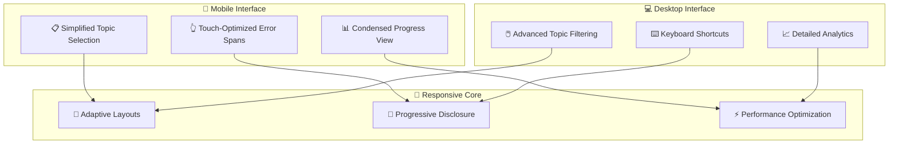

## 15. 🛡️ **Error Handling & Resilience**

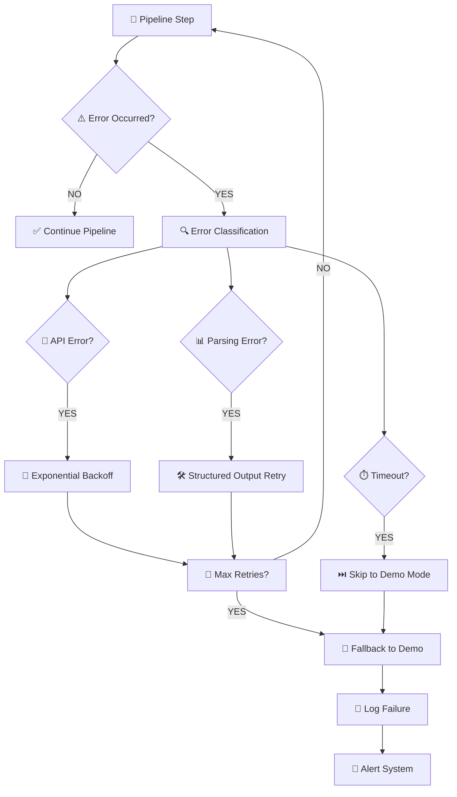

---

## 🎯 **Key Architectural Decisions**

### **1. Multi-Agent Orchestration**
- **Strategic Agent** (Sonnet 3.5 v2) handles complex reasoning tasks (Steps 1,2,3,6,7)
- **Implementation Agents** (Haiku 3.5, Haiku 3) provide differentiated responses (Steps 4,5)
- **System Agents** handle scoring, storage, and analytics

### **2. Structured Data Flow**
- Tool schemas enforce consistent JSON structure across all pipeline steps
- Pipeline results stored with full audit trail for analysis
- Automated rubric scoring with detailed breakdowns

### **3. Hybrid Demo Architecture**
- Hardcoded gold standard examples for reliable, fast demos
- Live generation with comprehensive fallback mechanisms
- Topic-specific caching for performance optimization

### **4. Scalable Storage Design**
- Relational database for structured queries and analytics
- JSON storage for flexible pipeline data and configurations
- Analytics-optimized data models for performance insights

### **5. Fail-Safe Mechanisms**
- Multiple retry attempts with intelligent backoff strategies
- Timeout handling with graceful degradation to cached examples
- Comprehensive error logging and alerting systems

### **6. Performance Optimization**
- Structured outputs reduce parsing failures
- Caching strategy balances freshness with speed
- Progressive enhancement for different user contexts

### **7. Domain Flexibility**
- Pipeline configuration adapts to technical, business, or general domains
- Rubric system works across different knowledge areas
- Topic routing optimizes experience based on content type

---

## 🚀 **Implementation Priorities**

### **Phase 1: Core Stability**
1. ✅ Structured outputs for all JSON parsing steps
2. ✅ Database integration with comprehensive logging
3. ✅ Gold standard examples for demo mode
4. 🔄 Error handling and retry mechanisms

### **Phase 2: User Experience**
1. 🎯 Frontend interface with interactive error spans
2. 📊 Real-time progress indicators
3. 🎪 Demo vs live mode switching
4. 📱 Mobile-responsive design

### **Phase 3: Intelligence & Analytics**
1. 📈 Analytics dashboard for success metrics
2. 🧠 Topic performance analysis
3. 🔄 Automated prompt optimization
4. 💡 Intelligent topic suggestions

### **Phase 4: Advanced Features**
1. 🎓 Multi-user session management
2. 🛡️ Anti-cheating integration
3. 🌐 API for third-party integrations
4. 🤖 Advanced AI orchestration

This architecture provides a solid foundation for both the current system and future enhancements aligned with the big vision.